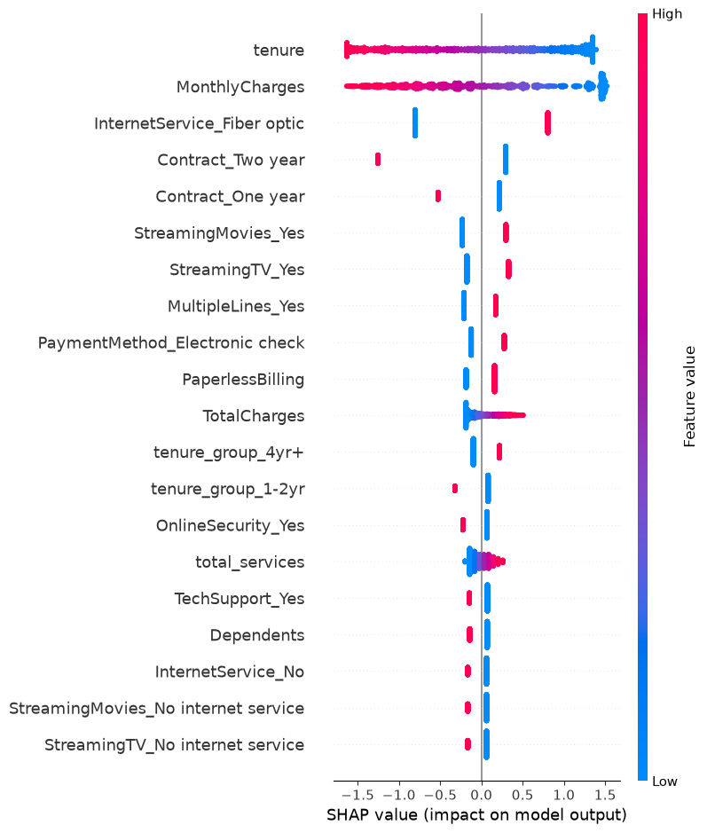
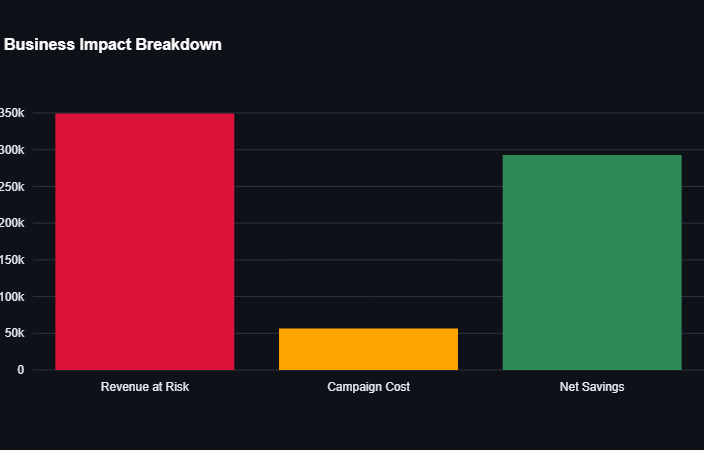

# 📊 Customer Churn Prediction & Business Impact Dashboard

## 🎯 Problem Statement
Customer churn directly impacts revenue for subscription-based businesses (telecom, SaaS, etc.). Acquiring a new customer costs significantly more than retaining an existing one. This project builds a machine learning system to **predict which customers are likely to churn**, **explain why**, and **quantify the business value** of proactive retention campaigns.

## 📂 Dataset
- **Source:** [Telco Customer Churn Dataset (Kaggle/IBM Sample)](https://www.kaggle.com/datasets/blastchar/telco-customer-churn)
- 7,043 customers, 21 original features (demographics, services subscribed, billing info)
- Target: `Churn` (Yes/No) — 26.5% churn rate (moderate class imbalance)

## 🔍 Approac

### 1. Data Cleaning & EDA
- Fixed a data type inconsistency in `TotalCharges` (stored as text, contained blank values for 11 new customers with `tenure=0`). Investigated the root cause before imputing — confirmed these were customers who hadn't completed a billing cycle yet, and filled with 0 based on that logic rather than blindly using mean/median.
- Key findings:
  - Month-to-month contracts churn at **43%**, vs. **11%** for one-year and **3%** for two-year contracts
  - Fiber optic customers churn at a notably higher rate than DSL customers
  - Churned customers have ~18 months average tenure vs. ~37.5 months for retained customers

### 2. Feature Engineering
- `tenure_group`: bucketed tenure into lifecycle stages (0-1yr, 1-2yr, 2-4yr, 4yr+)
- `total_services`: count of subscribed add-on services (engagement proxy)
- `avg_monthly_spend`: TotalCharges normalized by tenure

Categorical variables were binary-mapped (Yes/No, gender) or one-hot encoded (Contract, PaymentMethod, InternetService, etc., with `drop_first=True` to avoid the dummy variable trap).

### 3. Modeling
Used a stratified 80/20 train-test split to preserve the churn ratio across both sets. Compared three models, each handling class imbalance with `class_weight='balanced'` (Logistic Regression, Random Forest) or `scale_pos_weight` (XGBoost):

| Model               | Recall (Churn) | Precision (Churn) | F1-Score |   ROC-AUC  |
| ------------------- | :------------: | :---------------: | :------: | :--------: |
| Logistic Regression |    **0.79**    |        0.50       |   0.61   | **0.8425** |
| Random Forest       |      0.77      |      **0.52**     | **0.62** |   0.8419   |
| XGBoost             |      0.78      |      **0.52**     | **0.62** |   0.8385   |

**Final model: Logistic Regression** — chosen for its highest recall and ROC-AUC, strong interpretability for business stakeholders, and because the more complex tree-based models showed negligible improvement, suggesting the relationships in this data are largely linear. Recall was prioritized over precision because, in this context, missing an actual churner (false negative) is costlier to the business than a false alarm.

*Note: SMOTE was considered as an alternative imbalance-handling technique but not implemented, since the imbalance here is moderate (73:27) and `class_weight='balanced'` already produced strong recall. This is a natural extension for future work.*

### 4. Explainability (SHAP)
Used SHAP to validate model decisions against EDA findings — confirmed that `tenure`, `MonthlyCharges`, `Contract type`, and `InternetService (Fiber optic)` are the strongest churn drivers, with directionality matching business intuition. This consistency between EDA and model explainability builds confidence that the model is learning genuine patterns, not noise.

### 5. Business Impact
Translated model predictions into a retention campaign ROI estimate, using the top 20% highest-risk customers (by predicted churn probability) on the test set:

| Metric                         | Value                     |
| ------------------------------ | ------------------------- |
| High-Risk Customers Identified | 282                       |
| Actual Churners Among Them     | 185 (65.6% Precision)     |
| Estimated Revenue at Risk      | ₹3,49,334                 |
| Retention Campaign Cost        | ₹56,400                   |
| **Net Potential Savings**      | **₹2,92,934 (~6.2× ROI)** |

*Assumptions: ₹200 retention offer cost per customer, 24-month average customer lifetime value. These are illustrative and would be validated with business stakeholders in a real deployment.*

## 🖥️ Dashboard
Built an interactive Flask-based web application with HTML, CSS, and JavaScript for the user interface. The application allows users to enter customer details, receive churn predictions with risk explanations, and view business impact metrics through interactive Plotly visualizations.

- **Language:** Python
- **Data handling:** pandas, numpy
- **ML:** scikit-learn, XGBoost
- **Explainability:** SHAP
- **Web App:** Flask, HTML, CSS, JavaScript
- **Visualization:** Plotly  

## 🚀 How to Run

-bash
git clone <your-repo-url>
cd churn-prediction
pip install -r requirements.txt
python flask_app.py

## 📁 Project Structure

churn-prediction/
├── data/
│   ├── raw/                          # original dataset
│   └── processed/                    # cleaned, encoded dataset
├── notebooks/
│   ├── 01_eda.ipynb                  # exploratory data analysis
│   ├── 02_feature_engineering.ipynb  # feature creation + encoding
│   └── 03_modeling.ipynb             # training, SHAP, business impact
├── models/                           # saved model, scaler, feature columns
├── app/
│   ├── streamlit_app.py              # home page
│   └── pages/
│       ├── 1_Prediction.py
│       └── 2_Business_Impact.py
├── requirements.txt
└── README.md

## 🔮 Future Improvements
- Compare SMOTE against `class_weight='balanced'` for imbalance handling
- Add CSV batch upload for bulk predictions
- Track model performance over time (data drift monitoring)
- A/B test actual retention campaign effectiveness vs. model predictions
- Deploy with a CI/CD pipeline and experiment tracking (MLflow)

## 👤 Author
**Valli Bhargavi Jalla**
